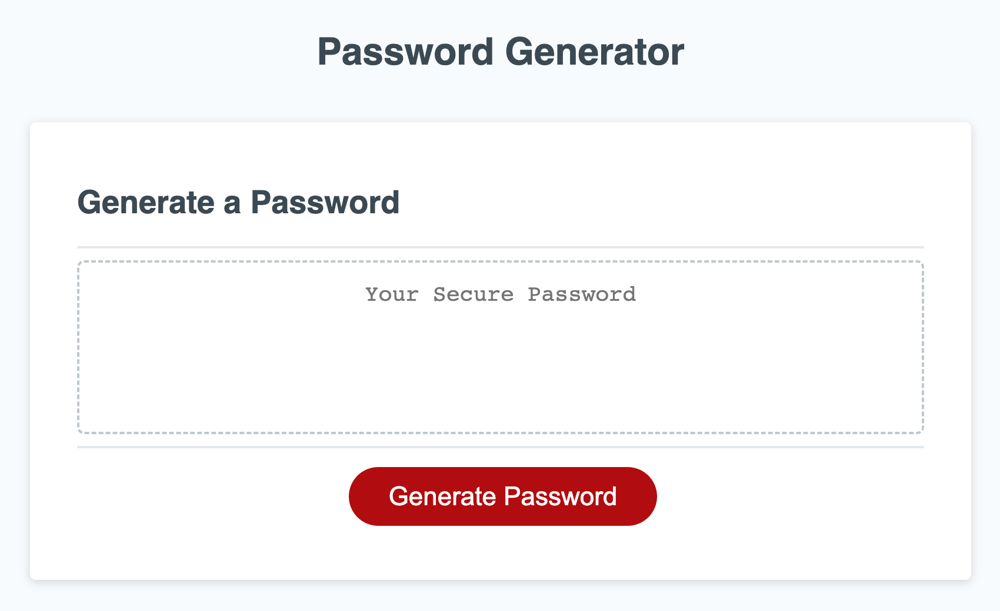

# password-challenge

## Description

This Password Challenge was created as part of the requirements for a Full Stack Development boot camp. After pressing the Generate Password button and answering the prompts, a password will be generated that meets all of the specified criteria.

## Usage

Navigate to the deployed portfolio with the following link: https://keimdm.github.io/password-challenge/

After pressing the Generate Password button, the following prompts will appear. If an invalid input is received, the prompts for the relevant section will start again.

1. Length of password (required to be a number between 8 and 128)
2. Character specifications (at least one must be true)
* Whether or not lowercase letters should be included
* Whether or not uppercase letters should be included
* Whether or not numbers should be included
* Whether or not special characters should be included

The password is then generated by first selecting a random character set out of the approved ones from above, and then selecting a random character out of that set. The chosen character is appended to the output string, and the process is repeated until the string has reached the desired length.